# TrafficAnalyzer

TrafficAnalyzer 是一款面向安全分析、应急响应和流量排查场景的 Windows 桌面工具。它以 PCAP 和 HTTP 数据为入口，将流量检索、请求响应还原、威胁检测、行为分析、数据解密、WebShell 分析及主动重放整合在同一个工作空间中。

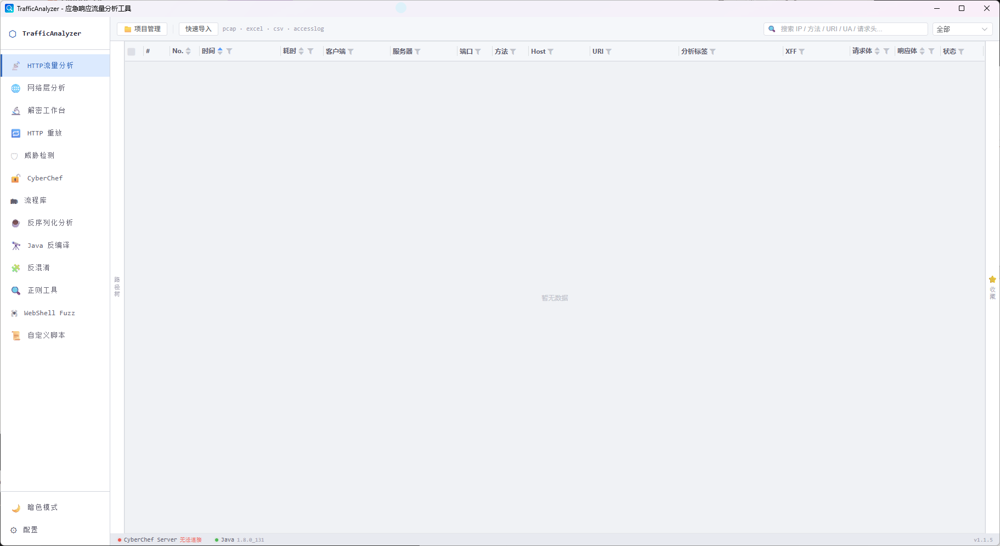

---

## 适用场景

- 从 PCAP、表格或访问日志中快速整理 HTTP 请求与响应
- 在大量流量中检索可疑 IP、URI、请求头、请求体和响应内容
- 识别扫描、注入、WebShell、反序列化、异常访问等行为
- 对编码、压缩、加密或混淆数据建立可复用的处理流程
- 对捕获到的 HTTP 请求改包重放，辅助验证分析结论
- 解析 Java 序列化数据、反编译 Class 字节码和静态还原混淆源码

典型工作流：

```text
导入数据 → 筛选流量 → 查看请求/响应 → 威胁与行为分析 → 解密/反混淆 → 保存流程复用
```

---

## 数据导入与项目管理

TrafficAnalyzer 使用项目保存分析数据，每个项目使用独立 SQLite 数据库保存流量、分析结果，可以导入多个数据源合并进行分析，支持的数据源如下：

- **PCAP**：调用 tshark 提取 HTTP 数据，并保留网络层分析所需的原始文件信息
- **Excel / CSV**：支持字段映射、自动识别和导入预览
- **Access Log**：支持 Apache/Nginx 常见格式及自定义日志格式解析

---

## 功能模块

### 1. HTTP 流量分析

HTTP 流量分析是主要的数据审查入口，用于从事务视角查看请求与响应。导入数据源后会自动根据导入文件类型进行解析：

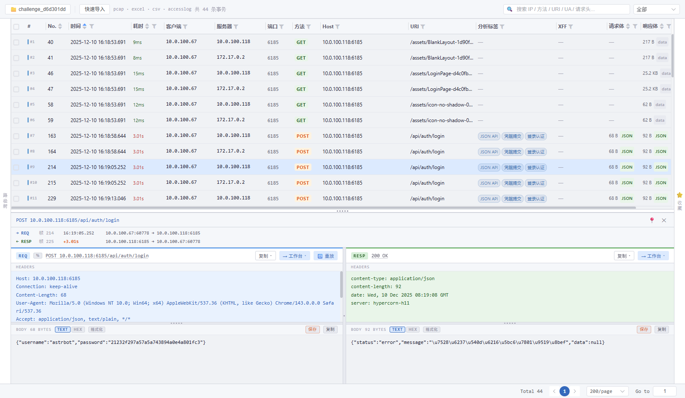

主要功能/能力包括：

- 自动配对 HTTP 请求和响应，并区分完整事务、无响应请求、孤立响应和 WebSocket 数据
- 支持全文搜索、分页、排序以及时间、耗时、IP、方法、状态码等列级筛选
- 按 Host 和 URI 生成路径树，可隐藏全 404 路径并组合筛选
- 在同一详情面板中对照请求头、请求体、响应头和响应体
- Body 支持 TEXT/HEX 查看、格式化、图片识别与预览、原始字节保存
- 支持 URL 解码、内容复制以及将请求或响应发送到解密工作台
- 可将捕获的请求直接发送到 HTTP 重放页面进行修改和验证
- 支持批量选择事务，并保持请求与响应共享的分析编号
- 支持按项目收藏重点流量，便于跨页对照
- 展示威胁、行为和上下文分析标签；标签管理支持证据查看和业务例外规则

### 2. 网络层分析

网络层分析基于原始 PCAP 提取 IPv4/IPv6、TCP/UDP Flow，用于从通信关系而不仅是 HTTP 内容观察事件。

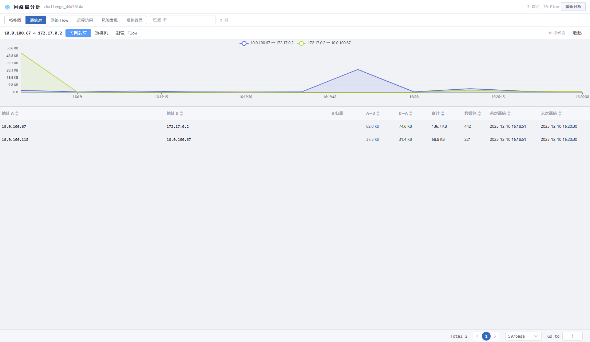

主要功能/能力包括：

- 以拓扑图展示内网、公网、通信方向、端口和应用协议
- 汇总通信对、双向字节数、数据包数量和通信时间线
- 查看网络 Flow 的发起端、响应端、协议、握手状态、载荷、重传和帧范围
- 识别 SSH、RDP、DNS、TLS、SMB、数据库等常见应用协议线索
- 单独聚合 SSH/RDP 远程访问行为
- 检测端口扫描、主机探测、SYN 洪泛、异常数据外发和网络层 C2 心跳
- 检测疑似远程服务爆破、公网入站远程访问和内网横向远程访问
- 支持风险规则的启用、停用与结果筛选

> 网络层分析仅适用于 PCAP 数据源，访问日志项目不包含生成网络 Flow 所需的信息。

### 3. 解密工作台

解密工作台用于对请求和响应进行批量、可复用的数据处理。其数据可来自于流量分析模块，在选中数据后右键或者点击HTTP详情面板的“->工作台”按钮均可将数据发送至解密工作台：

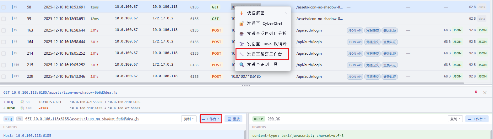

也可以点击“+”手动输入：

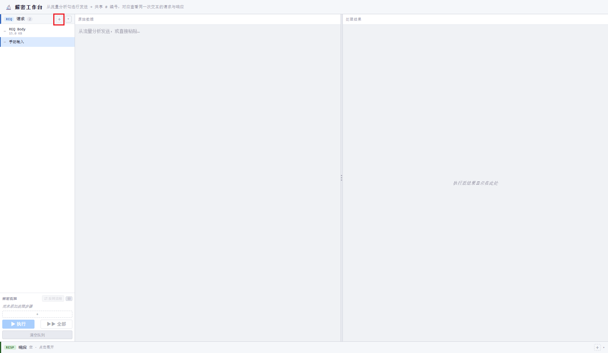

有了原始数据之后可以点击添加一个或者多个流程步骤，点击执行后，数据处理结果将展示在右侧。

主要功能/能力包括：

- 请求与响应使用独立队列和独立 Pipeline，可按同一事务编号对照处理
- 支持手动输入，也可从 HTTP 流量分析批量发送数据
- Pipeline 可组合以下步骤：
  - 已保存的 CyberChef 流程
  - 自定义 Go 脚本
  - 正则替换
  - 正则捕获后对子串逐项处理
- 支持调整步骤顺序、单步执行、批量执行和结果回填
- 支持将可逆流程切换为反向流程，用于在解密与加密方向之间转换
- WebShell 模板参数可直接在步骤中填写或覆盖
- 结果支持 TEXT/HEX、二进制识别、文件类型提示、图片预览和无损导出
- 可将字节结果继续发送到 Java 反编译模块

### 4. HTTP 重放

HTTP 重放用于对已捕获请求进行修改并发送到指定测试目标，可在流量分析处的详情面板中点击“重放”按钮快速填充内容。

- 从流量详情一键重建请求，也可直接粘贴原始 HTTP 请求
- 可修改协议、目标 Host、请求头、请求体、超时和 TLS 校验选项
- 自动按实际发送内容修正 Content-Length
- 请求体发送前可串联多个处理流程
- 可将解密流程反转为加密流程，以明文构造加密协议请求
- 发送前支持预览最终请求体
- 展示响应状态、耗时、响应头和响应体，并保留本次运行期间的重放历史
- 响应体可继续发送到 CyberChef

### 5. 威胁检测

威胁检测将规则命中、统计信息和行为画像集中展示，当前项目存在数据时，可点击“分析当前pcap”按钮开始分析。

- 检测 SQL 注入、XSS、LFI、RCE、SSRF、Java 反序列化、WebShell、扫描和异常请求等风险
- 支持内置规则、OWASP CRS、YAML 规则和自定义规则
- 支持规则搜索、分类筛选、启停和来源管理
- 将同一来源、目标和时间窗口内的多条证据聚合为更易审查的攻击事件
- 可从告警证据直接返回对应 HTTP 详情
- 提供请求量、状态码、Top IP、Top URI 和时间分布等总览
- 以路径树观察站点结构、访问量、规则命中和最高风险等级
- 基于请求频率、URI 多样性、错误率和写操作比例生成 IP 行为评分
- 基于访问集中度、方法多样性、敏感关键词、状态分布和规则命中生成 URI 评分
- 通过请求时间间隔和稳定性识别疑似 HTTP C2 信标
- 可直接导入访问日志并运行相同的威胁与行为分析

### 6. CyberChef

工具内嵌 CyberChef 页面，适合交互式编排和验证数据转换过程，是解密工作台中可调用流程的来源之一，在此处可以选择需要的加解密、编解码流程：

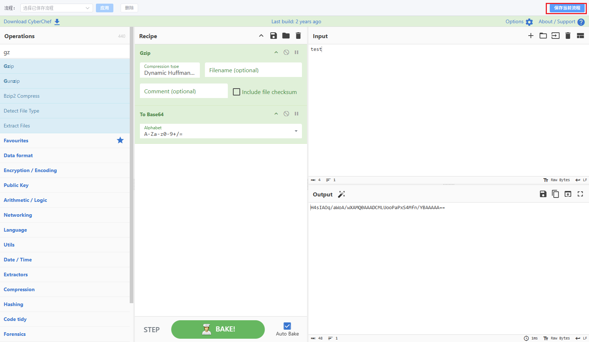

调试完成后可以保存为一个固定流程：

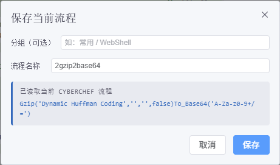

后续就可以在支持调用处理流程的地方选择该流程，例如解密工作台：

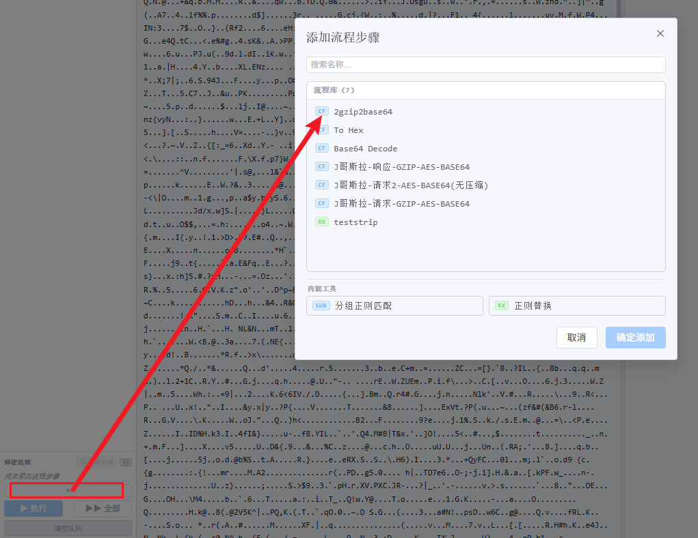

- 支持加载本地 CyberChef 页面
- 可保存当前 Recipe，并按 `分组/名称` 方式组织
- 已保存流程可被工作台、重放、正则工具、反序列化和反编译模块复用
- 在其他页面选中文本后，可通过右键菜单发送到 CyberChef
- 支持配置独立的 cyberchef-server 地址，用于批量和程序化执行流程

### 7. 流程库

流程库是全应用处理流程的统一管理入口。

- 搜索、分组查看、重命名和删除 CyberChef 流程
- 以 JSON 导入或导出单个/全部流程
- 查看流程中的算子链并使用样本即时测试
- 将可逆的解密流程反转并保存为新的加密流程
- 通过往返测试验证反转后的流程能否正确恢复原始数据
- 汇总查看 WebShell Profile 和自定义脚本，并跳转到对应编辑页面

### 8. WebShell 解密 Fuzz

WebShell Fuzz 面向未知或半未知的 WebShell 通信加密数据，支持的解密类型有：

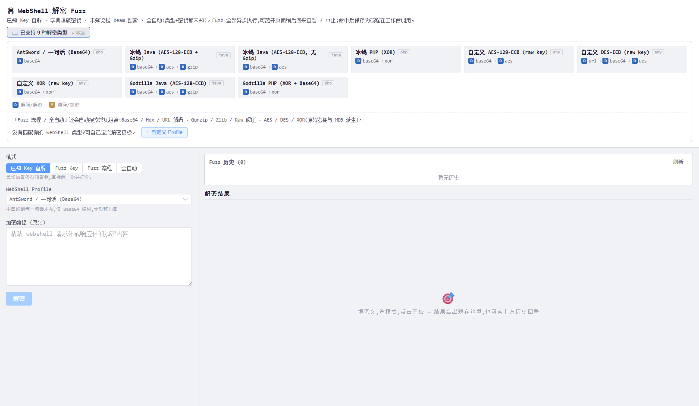

支持的fuzz方式：

- **已知 Key 直解**：已知 WebShell 类型和参数时直接还原
- **Fuzz Key**：已知算法或 Profile，通过字典枚举密码或密钥
- **Fuzz 流程**：已知或不需要密钥时，搜索可能的数据处理链
- **全自动**：同时搜索类型、处理流程和密钥候选

以一个冰蝎webshell默认密钥通信数据为例，已知其为冰蝎，则可选定其解密流程，输入加密数据然后点击fuzz：

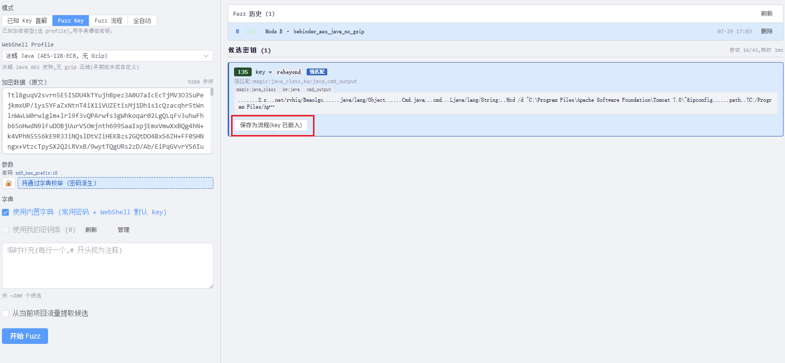

该程序会自动尝试利用自带字典以及默认key去尝试爆破，根据解密是否成功以及是否有可见可疑字符串来判断是否fuzz成功。fuzz出结果后可以点击“保存为流程按钮”，将当前解密流程以及key自动生成可在其他地方调用的流程。

- 搜索 Base64、Hex、URL 编码、压缩、AES、DES、XOR 及常见派生组合
- 支持添加多个样本进行交叉验证，降低偶然命中的误报
- 可从当前项目的 Cookie、请求头、URL 参数和文件名中提取密钥候选
- 支持内置字典、个人密钥库和临时字典
- Fuzz 任务异步运行，可离开页面后返回查看或中止
- 命中的候选可保存为流程，供工作台和重放模块继续使用
- 支持自定义 WebShell Profile，以扩展私有协议或新的加密方式

当前该功能还在进一步调试中。

### 9. Java 反序列化分析

- 解析以 `AC ED 00 05` 开头的 Java 原生序列化数据
- 支持粘贴 Base64、Hex、原始字节内容或直接从文件导入
- 可先调用已保存的 CyberChef 流程进行 URL、Base64 等预处理
- 展示序列化流的结构化解析结果
- 可从其他页面选中文本，通过右键菜单直接发送并跳转

### 10. Java 反编译

- 使用 CFR 反编译 Java `.class` 字节码
- 支持 Base64、Hex、原始字节内容和 Class 文件导入
- 支持在反编译前调用 CyberChef 流程预处理
- 可接收解密工作台输出的原始字节结果
- 提供源码查看、换行和复制等基础操作

### 11. 反混淆

- 对 WebShell 或载体源码进行纯静态还原，不执行待分析代码
- 支持 Unicode、Hex、八进制转义
- 支持 reverse/strrev、String.fromCharCode、chr、base64_decode/atob 等常见形式
- 支持 Java 字节/字符数组以及部分单字节 XOR 自动尝试
- 对多层混淆重复处理直至结果不再变化
- 展示命中的还原步骤，无法识别的内容保持原样

> 当前该功能还较为简单

### 12. 正则工具

- 实时高亮匹配内容并显示匹配位置
- 展示普通捕获组和命名捕获组
- 支持常用正则 Flags
- 提供替换结果预览和反向引用
- 可将捕获到的子串逐项送入指定 CyberChef 流程，再回填最终结果
- 支持保存常用正则，并在解密工作台中复用

### 13. 自定义脚本

对于不好使用cyberchef进行流程创建的复杂文本操作，可以按照程序给定的输入输出格式，自定义一段go语言程序对内容进行处理并返回：

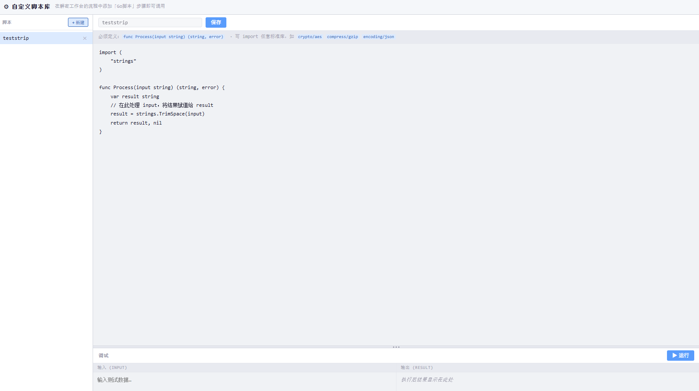

- 在应用内创建、编辑、保存和调试 Go 脚本
- 脚本统一使用 `func Process(input string) (string, error)` 作为处理入口
- 可使用 Go 标准库完成自定义编码、解压、密码学或结构化数据处理
- 提供独立的输入/输出调试区域
- 保存后可作为解密工作台 Pipeline 的处理步骤

---

## 模块联动

TrafficAnalyzer 的各页面并非相互独立，常用联动包括：

- HTTP 流量 → 解密工作台：批量发送请求体和响应体
- HTTP 流量 → HTTP 重放：载入原始请求并改包验证
- HTTP 告警 → 流量详情：从威胁证据定位到完整请求与响应
- 页面选中文本 → CyberChef / 反序列化：通过全局右键菜单快速跳转
- CyberChef → 流程库 → 工作台/重放：保存一次，多处复用
- 正则工具 → 工作台：复用已保存的替换或分组处理规则
- WebShell Fuzz → 流程库：将命中结果保存为可复用流程
- 解密工作台 → Java 反编译：保留原始字节继续分析

---

## 运行环境与可选能力

### 基础运行环境

- Windows 10/11

### 外部组件

部分功能依赖发布包中的组件或本机环境，主要环境均已在./lib/目录中，**仅cyberchef-server需要自行通过容器部署**：

项目地址：[cyberchef-server](https://github.com/gchq/CyberChef-server)

需要注意的是，官方默认配置中支持的请求体大小限制的比较低，这里提供一个快速启动命令：

```
# 将 body-parser 的 limit 扩大到 500mb
docker run -d \
  --name cyberchef-api \
  -p 3000:3000 \
  -e PORT=3000 \
  ghcr.io/gchq/cyberchef-server:latest \
  /bin/sh -c "sed -i 's/limit: .*/limit: \"500mb\"/' node_modules/body-parser/lib/types/json.js && npm start"
```

不部署cyberchef-server无法使用加解密等相关功能，但不影响流量分析等基础功能，以下为所需各组件涉及的功能点：

| 组件 | 影响的功能 |
|---|---|
| tshark / Wireshark 运行库 | PCAP 导入、HTTP 提取、网络层分析 |
| CyberChef 静态页面 | 应用内嵌 CyberChef |
| cyberchef-server | 工作台批处理、流程测试、正则分组处理等程序化解密 |
| Java Runtime + CFR | Java Class 反编译 |
| OWASP CRS | CRS 规则检测 |
| GeoLite2 City | 离线 IP 地理位置显示 |

这些路径和服务地址可在“配置”页面中调整。底部状态栏会显示 CyberChef Server 和 Java 的可用状态，点击相应状态可重新检测。

---

## 快速开始

1. 从 [GitHub Releases](https://github.com/RynezzZ/TrafficAnalyzer/releases/latest) 下载并完整解压程序。
2. 在云服务器或者本地部署cyberchef-server
3. 启动 TrafficAnalyzer，点击“配置”，在“REST API 地址”中输入cyberchef-server开放的地址及端口。确认下方状态栏cyberchef-server与jdk状态。
4. 在“HTTP 流量分析”中点击“快速导入”，选择 PCAP、Excel、CSV 或访问日志。
5. 使用搜索、列筛选和路径树缩小数据范围，并点击事务查看完整详情。
6. 根据场景进入“威胁检测”“网络层分析”“解密工作台”或其他专项模块继续分析。

---

## 使用声明

TrafficAnalyzer 仅可用于合法授权的安全分析、应急响应和测试环境，不允许用以盈利或者以盈利为主要目的的商业行为中。使用 HTTP 重放、密钥枚举或其他主动能力前，请确认已获得目标系统所有者的明确授权。

使用中出现的问题欢迎提交issue反馈，请尽可能描述清楚或者附上图片说明。
